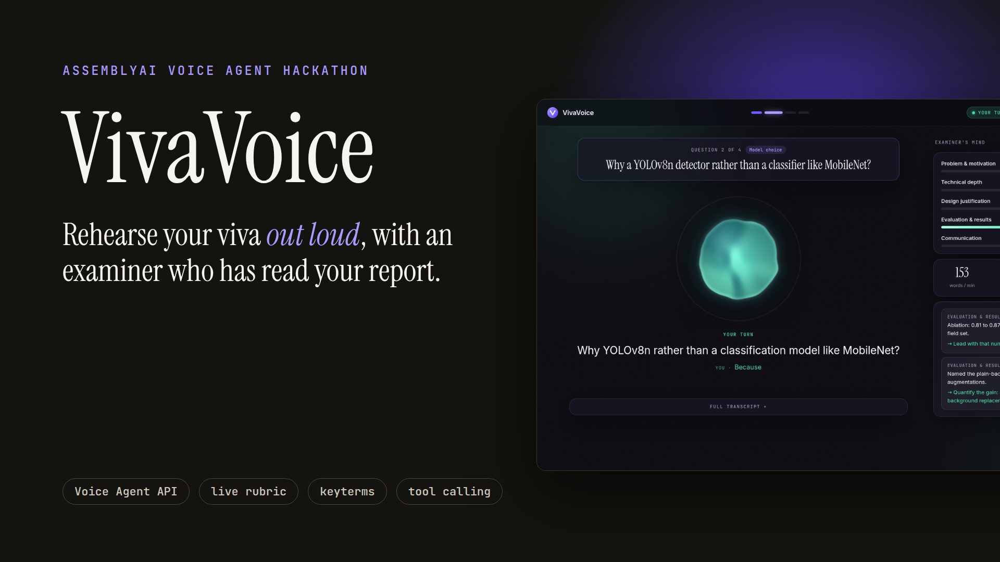
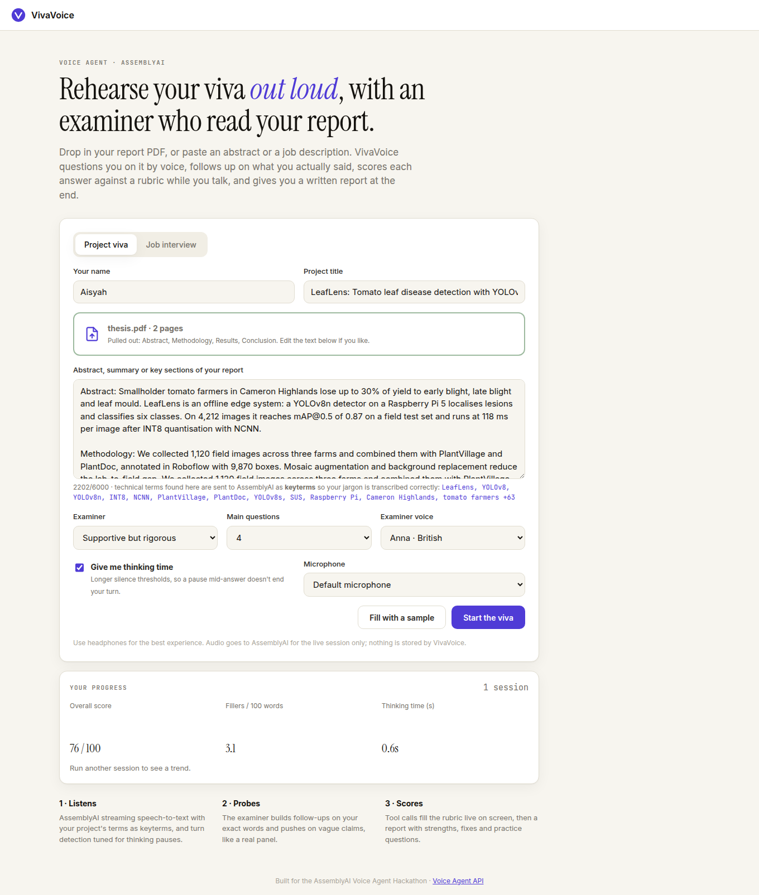
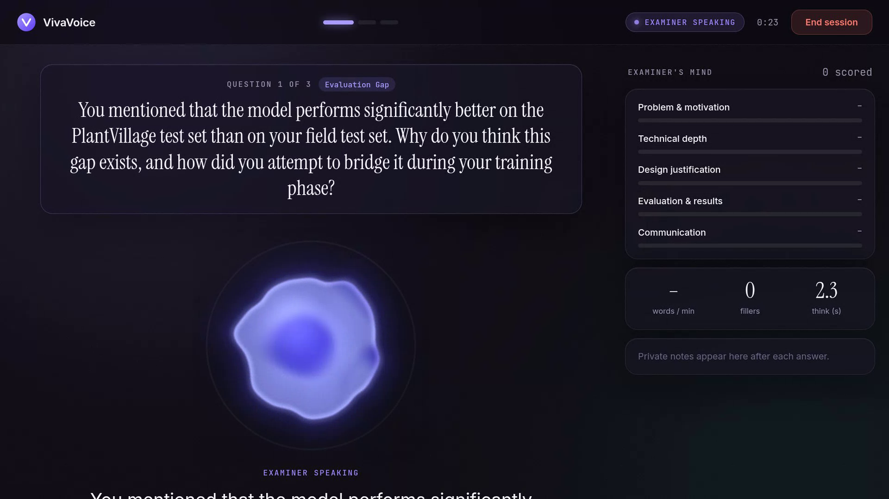
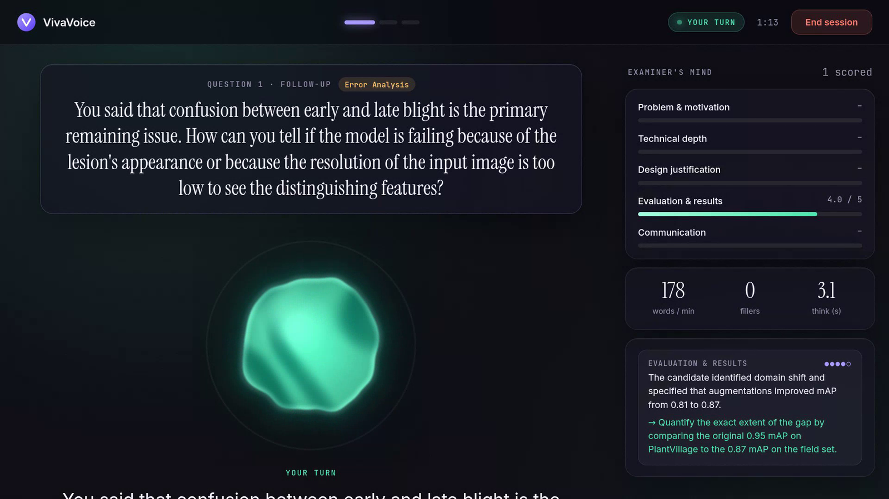
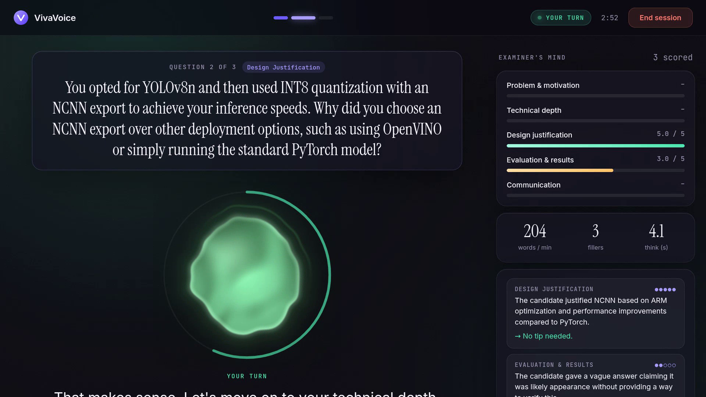
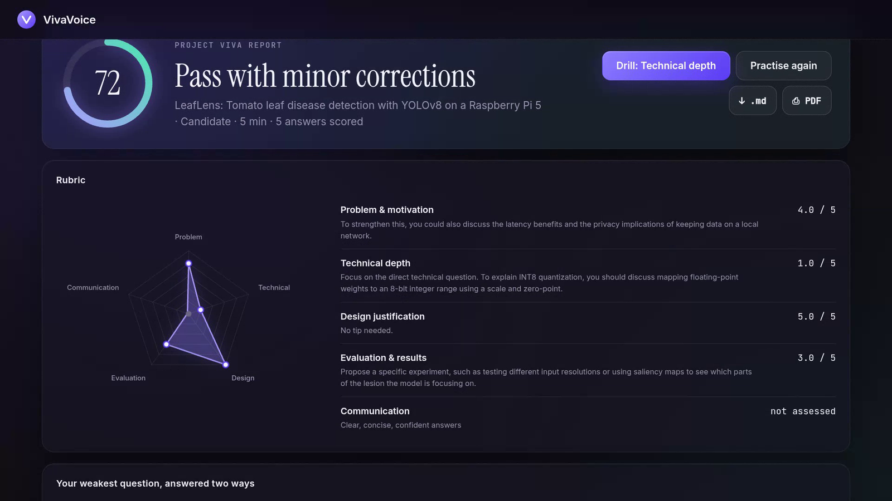
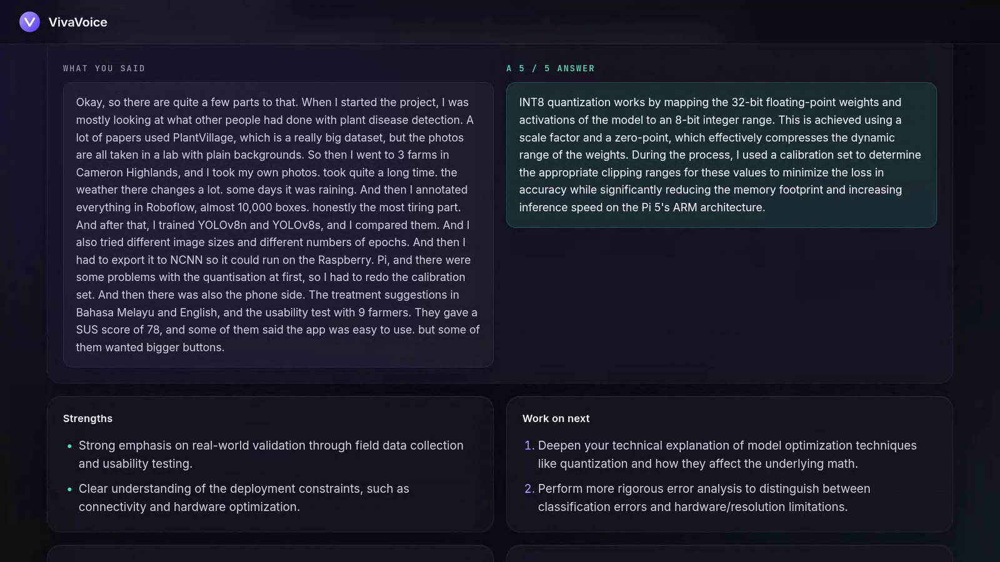
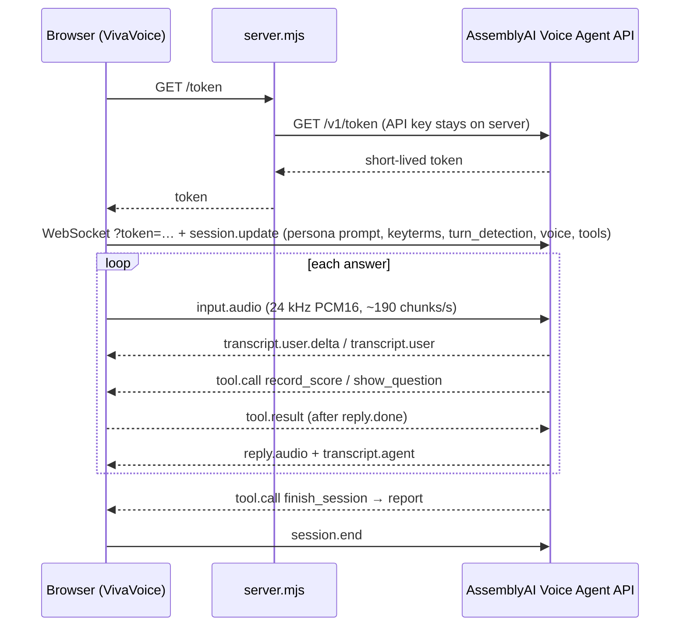

# VivaVoice 🎙️

**Rehearse your viva out loud, with an examiner who has read your report.**

VivaVoice is a real-time voice agent for students and job seekers. Paste your project abstract (or a job description) and a voice examiner questions you on it. It asks follow-ups built on what you actually said, scores every answer against a rubric **live on screen** while you talk, and gives you a written report at the end.

Built for the [AssemblyAI Voice Agent Hackathon](https://lablab.ai/ai-hackathons/assemblyai-voice-agent-hackathon) on the **[AssemblyAI Voice Agent API](https://www.assemblyai.com/docs/voice-agents/voice-agent-api)**.



**▶ [Watch the 4-minute demo video](docs/VivaVoice-demo.mp4)**: a real session with the AssemblyAI examiner, from PDF upload to the final report.

---

## Why

Every final-year student has to defend their project in a viva, and most people interview for jobs they care about. Nearly everyone prepares by *reading*, yet the test is *spoken*. Mock vivas need a lecturer's time, and generic interview bots ask textbook questions that have nothing to do with your work.

VivaVoice gives you unlimited spoken practice on **your own material**:

- It asks questions that come from your abstract ("Your field mAP is 0.87 but PlantVillage is 0.95. What explains that gap?"), not generic ones like "tell me about yourself".
- A vague answer gets a follow-up that builds on your exact words.
- You see where you're weak while it happens, then leave with specific fixes and practice questions.

## What it does

| | |
|---|---|
| **Drop in your report PDF** | The abstract, methodology, results and conclusion are pulled out in the browser with pdf.js; the file never leaves your computer. Or paste any text. |
| **Two modes** | *Project viva* (problem, technical depth, design justification, evaluation, communication) and *Job interview* (role fit, technical, problem solving, behavioural/STAR, communication). |
| **Two examiner personas** | Supportive but rigorous, or a strict external examiner who gives no hints. |
| **Live rubric** | The agent calls `record_score` after each answer, so bars fill in and private examiner notes (evidence + tip) appear as you speak. |
| **Question card** | The agent calls `show_question`, so the current question and topic stay on screen. Follow-ups are tagged as follow-ups. |
| **Delivery coaching** | Words per minute, filler words (highlighted in the transcript), and thinking time before each answer, all computed from AssemblyAI's live transcript and speech events. |
| **Jargon-aware listening** | Technical terms from your abstract (e.g. *YOLOv8n, NCNN, PlantVillage, Cameron Highlands*) are sent as **keyterms**, so AssemblyAI transcribes your field's vocabulary correctly. |
| **Thinking time** | One toggle raises the turn-detection silence thresholds, so pausing to think mid-answer doesn't end your turn. |
| **Barge-in** | Interrupt the examiner at any time; playback stops mid-word. |
| **Rambling alarm** | If one answer runs past 90 s, the examiner cuts in and asks for your main point, like a real panel. (`?ramble=30` on the URL shortens it for demos.) |
| **Model answer** | The report shows your weakest question with what you said next to a 5/5 answer built from your own material. |
| **Progress** | Every report is kept in your browser: score, fillers and thinking time trend across sessions, plus your most common weak area. |
| **Drill mode** | One button on the report starts a session that targets only your weakest criterion. |
| **Report** | Overall mark, verdict, strengths, prioritised improvements, rubric table, delivery stats, practice questions and full transcript. Export as Markdown or print to PDF. |

## Screenshots

These are from a real session with the AssemblyAI Voice Agent on the sample project (LeafLens, tomato leaf disease detection).

| 1. Start from your own report | 2. The examiner asks about *your* work |
|---|---|
|  |  |
| Drop in a PDF. The abstract, methods and results are extracted in the browser, and technical terms become AssemblyAI keyterms. | `show_question` puts each question on screen while the examiner speaks it. The rubric on the right fills as you answer. |

| 3. Vague answer? It follows up | 4. It keeps you to time |
|---|---|
|  |  |
| After a vague "um… it's probably the appearance", the examiner asks a follow-up built on those exact words. `record_score` adds private notes with evidence and a tip. | The ring shows how long the current answer has run. Ramble past the limit and the examiner cuts in. Pace, filler words and thinking time update live. |

| 5. A scored report | 6. Your weakest answer, answered two ways |
|---|---|
|  |  |
| Overall mark, verdict, a radar chart of the rubric and what to fix for each criterion. | What you actually said, next to a 5/5 answer built from your own report. One click starts a drill on that weak area. |

## How it uses AssemblyAI

Everything runs over one WebSocket to the **Voice Agent API** (`wss://agents.assemblyai.com/v1/ws`), which handles speech-to-text, turn detection, the LLM and text-to-speech in one session.



| Voice Agent API feature | How VivaVoice uses it |
|---|---|
| Inline `session.update` | System prompt is generated per session from the student's abstract, mode, persona and question count |
| `input.keyterms` | Up to 100 technical terms pulled from the abstract, to bias STT toward the student's jargon |
| `input.transcription_prompt` | A plain description of the session ("a university viva about LeafLens…") built from the report, so STT has context beyond single terms |
| `input.continuous_partials` | Steady live captions during long answers |
| `input.turn_detection` | "Thinking time" mode sets `min_silence` 1600 ms / `max_silence` 4500 ms; otherwise AssemblyAI's adaptive endpointing is left on |
| Client-side tools | `show_question`, `record_score` (with an enum of rubric ids), `finish_session` (report, weakest question and model answer); `response_instructions` keep scores unspoken, invalid calls return `is_error: true` |
| Tool timing rules | `tool.result` queued and sent only when `reply.done` is the latest event; dropped on interrupted replies ([toolqueue.js](public/toolqueue.js)) |
| `reply.create` | "End session" asks the examiner to wrap up and produce the report instead of hanging up cold; the rambling alarm uses it to make the examiner cut in mid-answer |
| `input.speech.started` / `stopped` | Barge-in (flush playback), plus speaking-time and thinking-time metrics |
| Temporary tokens | Browser never sees the API key; the server rate-limits token minting per IP |
| `session.end` | Sent explicitly so the session isn't left open and billing |
| `session.resume` | If the socket drops without `session.ended`, the app reconnects with a fresh token and resumes the same session inside AssemblyAI's 30 s window, so a Wi-Fi blip doesn't lose the viva |
| `max_session_duration_seconds` | Capped at 30 min; since the API gives no warning, the examiner is asked to wrap up a minute before the cap |

## Run it locally

Requires **Node 18+**. No dependencies to install.

```bash
git clone https://github.com/ShermaineYap/AssemblyAI-Voice-Agent-Hackathon.git
cd AssemblyAI-Voice-Agent-Hackathon
cp .env.example .env        # then put your key in it: ASSEMBLYAI_API_KEY=...
npm start                   # → http://localhost:3000
```

Open the page, click **Try a sample** (or drop in your report PDF), then **Start the viva**. Headphones are recommended.

Run the tests:

```bash
npm test
```

## Deploy

One click on Render: the included [`render.yaml`](render.yaml) asks for `ASSEMBLYAI_API_KEY` and nothing else.

| Variable | Default | Purpose |
|---|---|---|
| `ASSEMBLYAI_API_KEY` | required | Stays on the server |
| `PUBLIC_ORIGIN` | unset | If set, token requests from other origins are refused |
| `TRUST_PROXY` | unset | Set behind a proxy (Render) so the per-IP limit sees the real client IP |
| `TOKENS_PER_HOUR` | 20 | Sessions per IP per hour |
| `MAX_SESSION_SECONDS` | 1800 | Hard cap on a session's length |

## Project structure

```
server.mjs            zero-dependency Node server: static files, /token, /health, /config
public/
  index.html          setup → live → report views
  app.js              session lifecycle, event handling, tools, UI, report export
  session.js          builds session.update: prompt, rubric, tools, keyterms, turn detection
  toolqueue.js        tool.result timing per the Voice Agent API rules
  metrics.js          pace, filler words, thinking time
  audio.js            AudioWorklet mic capture + ring-buffer playback, resampled to 24 kHz
  aura.js             WebGL orb that reacts to both voices and changes colour with agent state
  report.js           fallback report if the session ends early
  samples.js          one-click sample viva and interview
  pdftext.js          pdf.js extraction and section picking (abstract, methods, results…)
  history.js          progress across sessions, kept in localStorage
  vendor/pdfjs/       pdf.js 6.3 (Apache-2.0), unmodified
test/                 node:test unit + server tests
```

## Roadmap

- Panel mode: two examiner voices taking turns
- Phone-in practice via Twilio SIP for students without a good laptop mic
- Bahasa Melayu and Mandarin examiner modes

## License

[MIT](LICENSE) © 2026 Shermaine Yap
