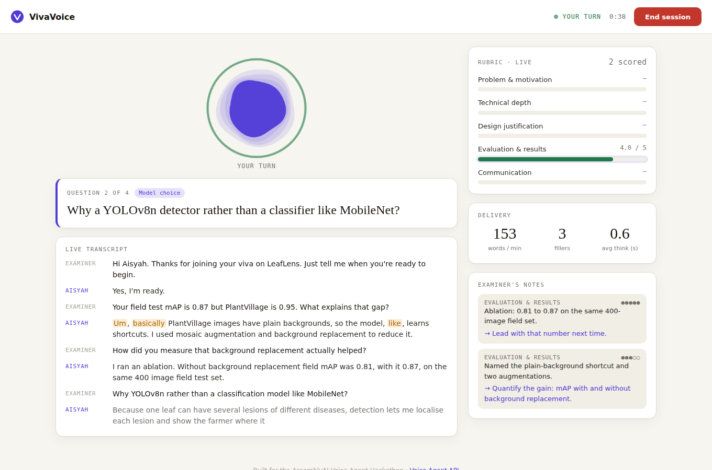
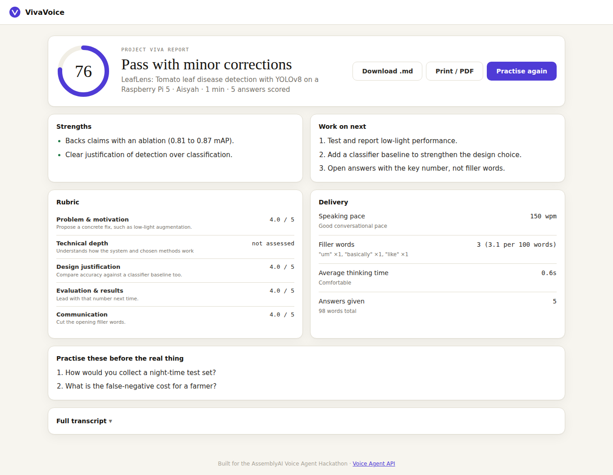
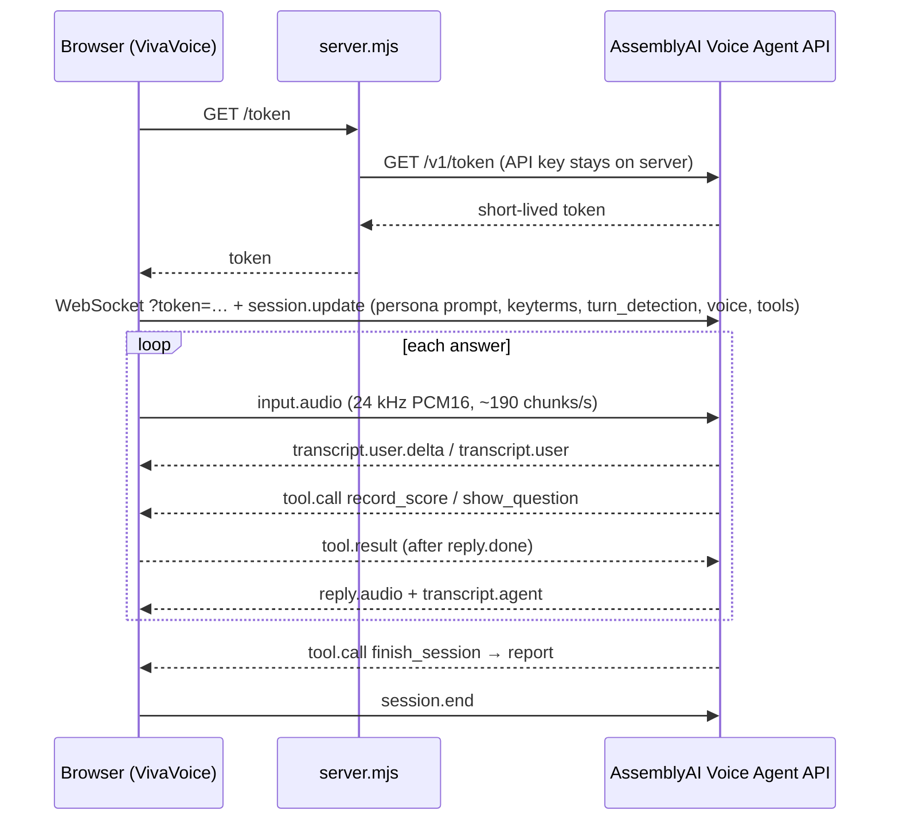

# VivaVoice 🎙️

**Rehearse your viva out loud, with an examiner who has read your report.**

VivaVoice is a real-time voice agent for students and job seekers. Paste your project abstract (or a job description) and a voice examiner questions you on it. It asks follow-ups built on what you actually said, scores every answer against a rubric **live on screen** while you talk, and gives you a written report at the end.

Built for the [AssemblyAI Voice Agent Hackathon](https://lablab.ai/ai-hackathons/assemblyai-voice-agent-hackathon) on the **[AssemblyAI Voice Agent API](https://www.assemblyai.com/docs/voice-agents/voice-agent-api)**.



---

## Why

Every final-year student has to defend their project in a viva, and most people interview for jobs they care about. Nearly everyone prepares by *reading*, yet the test is *spoken*. Mock vivas need a lecturer's time, and generic interview bots ask textbook questions that have nothing to do with your work.

VivaVoice gives you unlimited spoken practice on **your own material**:

- It asks questions that come from your abstract ("Your field mAP is 0.87 but PlantVillage is 0.95. What explains that gap?"), not generic ones like "tell me about yourself".
- A vague answer gets a follow-up that builds on your exact words.
- You see where you're weak while it happens, then leave with specific fixes and practice questions.

## What it does

| | |
|---|---|
| **Two modes** | *Project viva* (problem, technical depth, design justification, evaluation, communication) and *Job interview* (role fit, technical, problem solving, behavioural/STAR, communication). |
| **Two examiner personas** | Supportive but rigorous, or a strict external examiner who gives no hints. |
| **Live rubric** | The agent calls `record_score` after each answer, so bars fill in and private examiner notes (evidence + tip) appear as you speak. |
| **Question card** | The agent calls `show_question`, so the current question and topic stay on screen. Follow-ups are tagged as follow-ups. |
| **Delivery coaching** | Words per minute, filler words (highlighted in the transcript), and thinking time before each answer, all computed from AssemblyAI's live transcript and speech events. |
| **Jargon-aware listening** | Technical terms from your abstract (e.g. *YOLOv8n, NCNN, PlantVillage, Cameron Highlands*) are sent as **keyterms**, so AssemblyAI transcribes your field's vocabulary correctly. |
| **Thinking time** | One toggle raises the turn-detection silence thresholds, so pausing to think mid-answer doesn't end your turn. |
| **Barge-in** | Interrupt the examiner at any time; playback stops mid-word. |
| **Report** | Overall mark, verdict, strengths, prioritised improvements, rubric table, delivery stats, practice questions and full transcript. Export as Markdown or print to PDF. |



## How it uses AssemblyAI

Everything runs over one WebSocket to the **Voice Agent API** (`wss://agents.assemblyai.com/v1/ws`), which handles speech-to-text, turn detection, the LLM and text-to-speech in one session.



| Voice Agent API feature | How VivaVoice uses it |
|---|---|
| Inline `session.update` | System prompt is generated per session from the student's abstract, mode, persona and question count |
| `input.keyterms` | Up to 100 technical terms pulled from the abstract, to bias STT toward the student's jargon |
| `input.turn_detection` | "Thinking time" mode: `min_silence` 1600 ms, `max_silence` 4500 ms (vs 800/2500) |
| Client-side tools | `show_question`, `record_score` (with an enum of rubric ids), `finish_session` |
| Tool timing rules | `tool.result` queued and sent only when `reply.done` is the latest event; dropped on interrupted replies ([toolqueue.js](public/toolqueue.js)) |
| `reply.create` | "End session" asks the examiner to wrap up and produce the report instead of hanging up cold |
| `input.speech.started` / `stopped` | Barge-in (flush playback), plus speaking-time and thinking-time metrics |
| Temporary tokens | Browser never sees the API key; the server rate-limits token minting per IP |
| `session.end` | Sent explicitly so the session isn't left open and billing |

## Run it locally

Requires **Node 18+**. No dependencies to install.

```bash
git clone https://github.com/ShermaineYap/AssemblyAI-Voice-Agent-Hackathon.git
cd AssemblyAI-Voice-Agent-Hackathon
cp .env.example .env        # then put your key in it: ASSEMBLYAI_API_KEY=...
npm start                   # → http://localhost:3000
```

Open the page, click **Fill with a sample** (or paste your own abstract), then **Start the viva**. Headphones are recommended.

Run the tests:

```bash
npm test
```

## Deploy

One click on Render: the included [`render.yaml`](render.yaml) asks for `ASSEMBLYAI_API_KEY` and nothing else.

| Variable | Default | Purpose |
|---|---|---|
| `ASSEMBLYAI_API_KEY` | required | Stays on the server |
| `PUBLIC_ORIGIN` | unset | If set, only this origin can mint tokens |
| `TOKENS_PER_HOUR` | 20 | Sessions per IP per hour |
| `MAX_SESSION_SECONDS` | 1200 | Hard cap on a session's length |

## Project structure

```
server.mjs            zero-dependency Node server: static files, /token, /health, /config
public/
  index.html          setup → live → report views
  app.js              session lifecycle, event handling, tools, UI, report export
  session.js          builds session.update: prompt, rubric, tools, keyterms, turn detection
  toolqueue.js        tool.result timing per the Voice Agent API rules
  metrics.js          pace, filler words, thinking time
  audio.js            AudioWorklet mic capture + ring-buffer playback, resampled to 24 kHz
  report.js           fallback report if the session ends early
  samples.js          one-click sample viva and interview
test/                 node:test unit + server tests
```

## Roadmap

- Upload a PDF report and extract the abstract automatically
- Panel mode: two examiner voices taking turns
- Progress over time across practice sessions
- Phone-in practice via Twilio SIP for students without a good laptop mic
- Bahasa Melayu and Mandarin examiner modes

## License

[MIT](LICENSE) © 2026 Shermaine Yap
